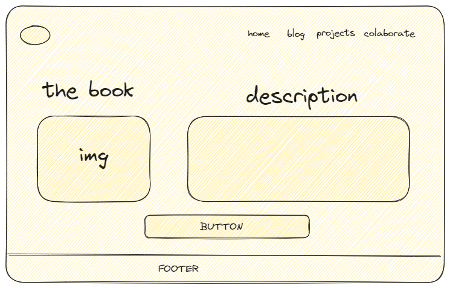

# Practice your HTML: Build a blog mockup

## Instructions

Imagine you are designing, or redesigning, your personal web site. Create a graphical mockup of your site, and then write down the HTML markup you would use to build out the various elements of the site. You can do this on paper, and scan it, or use software of your choice, just make sure to hand-code the HTML markup.

## Rubric

| Criteria | Exemplary                                                                           | Adequate                                                                         | Needs Improvement                                                                 |
| -------- | ----------------------------------------------------------------------------------- | -------------------------------------------------------------------------------- | --------------------------------------------------------------------------------- |
|          | A blog layout is represented visually with at least 10 elements of markup displayed | A blog layout is represented visually with around 5 elements of markup displayed | A blog layout is represented visually with at most 3 elements of markup displayed |




```html
<!DOCTYPE html>
<html lang="en">
<head>
    <meta charset="UTF-8">
    <meta name="viewport" content="width=device-width, initial-scale=1.0">
    <title>Welcome to my Virtual Terrarium</title>
</head>
<header>
    <div>
        
    </div>
    <div>
        <a href="">Home</a>
        <a href="">Blog</a>
        <a href="">Projects</a>
        <a href="">Colaborate</a>
    </div>
</header>
<body>
    <div>
        <h1>title the book</h1>
        
    </div>
    <div>
        <h2>subtitle-ddescription</h2>
        <p>
            Lorem ipsum dolor sit amet consectetur adipisicing elit.
            Eveniet adipisci soluta voluptates rerum aperiam consequatur unde temporibus, nam deleniti omnis aut cupiditate quaerat quos nemo labore esse tempore, pariatur recusandae.
        </p>
    </div>
    <button>Button</button>
</body>
<footer>Footer</footer>
</html>
```